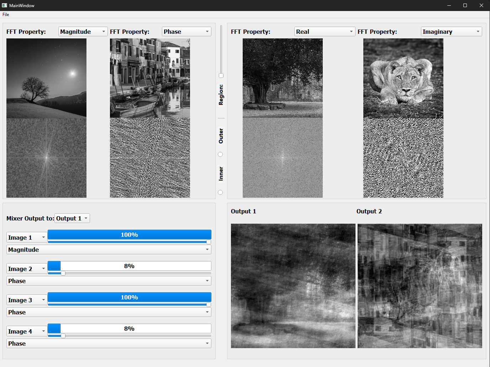

<h1>Fourier Transform Mixer</h1>

  
Design and implement a desktop program that illustrates the importance of magnitude and phase components, emphasizing the frequencies' contributions to a 2D signal (image). The software includes the following features:

  <h2>Image Viewers</h2>

  <ul>
    <li><strong>Open and View Images:</strong> Ability to open and view four grayscale images, each in a separate viewport.
      <ul>
        <li><em>No Colored:</em> If the user opens a colored image, the program converts it to grayscale.</li>
        <li><em>One Size:</em> The sizes of the opened images are unified to the 225x225.</li>
      </ul>
    </li>
    <li><strong>FT Components Display:</strong> For each image, the program has two displays - one fixed for the image and the second for components chosen from a combo-box/drop-menu selection: 1) FT Magnitude, 2) FT Phase, 3) FT Real, and 4) FT Imaginary.</li>
    <li><strong>Easy Browse:</strong> The user can open or change any image by left clicking on its viewer area.</li>
  </ul>

  <h2>Output Ports</h2>

  <ul>
    <li><strong>Two Output Viewports:</strong> The mixer result can be shown in one of two output viewports, each identical to the input image viewport. The user controls which viewport displays the new mixer result.</li>
    <li><strong>Brightness:</strong> Users can adjust the brightness of any image viewport via right mouse button dragging (up/down).</li>
  </ul>

  <h2>Components Mixer</h2>

  <ul>
    <li><strong>Weighted Average:</strong> Any output image is the inverse Fourier transform (ifft) of a weighted average of the Fourier transform (FT) of the input four images. Users can customize the weights of each image FT via sliders. Intuitive user interfaces for customizing weights for two components (e.g., magnitude and phase, or real and imaginary) are provided.</li>
  </ul>

  <h2>Regions Mixer</h2>

  <ul>
    <li><strong>Selectable Regions:</strong> For each FT component, users can pick regions for the output - inner region (low frequencies) or outer region (high frequencies). Users select the region via a slider, with options to include the inner or outer region. The selected region is left while the other region is nullified to represent the selection. Note that this region is unified for all four image components, and that the region is taken into consideration only when the component selected above is selected for mixing.</li>
  </ul>

  <h2>Screenshots</h2>

  
  

  <h2>Getting Started</h2>

  <ol>
    <li>Clone the repository.</li>
    <pre><code>git clone https://github.com/AssemSadek90/Fourier-Transform-Mixer.git</code></pre>
    <li>Install dependencies.</li>
    <pre><code>pip install -r requirements.txt</code></pre>
    <li>Run the application.</li>
    <pre><code>python main.py</code></pre>
  </ol>

  <h2>How to Use</h2>

  <ol>
    <li>Open the application.</li>
    <li>Load four grayscale images.</li>
    <li>Adjust FT components for each image and choose display options.</li>
    <li>Customize brightness as needed.</li>
    <li>Choose the output viewport for the mixer result.</li>
    <li>Adjust weights of each image and choose components for mixing.</li>
    <li>Use slider to select regions for each FT component.</li>
    <li>Explore the combined result and observe the impact of customization.</li>
  </ol>

  
Feel free to contribute, report issues, or suggest improvements!

  <h2>Contributors</h2>

  <ul>
    <li><a href="https://github.com/AssemSadek90">Assem Sadek</a></li>
  </ul>

  <h2>License</h2>

  
This project is licensed under the <a href="LICENSE">MIT License</a>.

</body>
